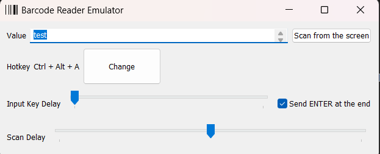

# Barcode reader emulator

[](https://oxcafedead.github.io/barcode-reader-emulator/)

A standalone Windows desktop app. Emulates a barcode reader device (which behaves like a keyboard). Triggers barcode 'reading' with a hotkey event which can be configured.

## Usage

- Download the executable in the latest [release](https://github.com/rabbaimehdi/barcode-reader-emulator/releases). 
- Run it.
- Optionally, you can change the settings.
    - To change a hotkey combination, just click on the "Change" button near Hotkey field. Select keys for the new combination (multi-selection is supported for special keys). Keep in mind that some combinations are already bind in the system and cannot be used.
    - You can also parse an existing barcode on the screen by clicking on the "Scan from the screen" button. The screen will be automatically parsed and set to the "Value" field.
- Just go to the target place (standalone app, browser tab or any other) which you are going to test with a barcode input.
- Press the hotkey.
- For multiscans (simulating successives barcode scans) use a semicolon ; between codes, the slider "scan delay" can be adjusted to define the time between scans. 

## Screenshot


## Known issues/limitations

The list of characters supported for now (as generally the majority of barcode scanners support only basic characters):

| Characters  |
| ------------- |
| 0-9  |
| a-z  |
| A-Z  |
| \`~!@#$%^&*()_+-=&sol;;',.&bsol;:"<>? |

Also, the _US keyboard layout_ should be used (switch to it in the settings).

Only Windows operating system is supported for now.


## Build
First, install Go.
Then install all dependencies, do:
```cmd
go install
staticcheck
go test
```
Then run
```
.\build.bat
```
